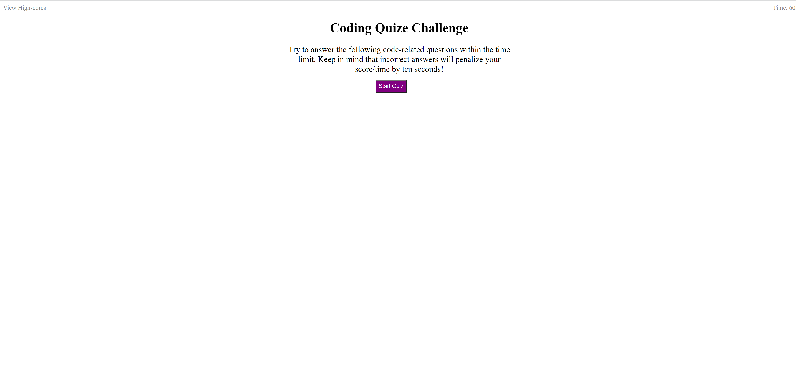

About the project: The goal of the project was to create a code quiz that a user can take and have their score logged with their initials. The score is based on how long it takes the user to answer the 5 questions. If the answer is incorrect 10 seconds is taken away from the remaining time. Once the user has finished the quiz or the time has run out, they are prompted to input their initials. They are then shown a page with all of the initials and scores saved in local storage. The user can either go back to take the quiz again or clear the local storage of the saved highscores.

Built using: HTML CSS and Javascript

Usage: On initialization the user will be given directions on how the quiz will work. They can either click on the highscores button to see the current highscore page, or click on the start button to start the quiz. When the quiz is started the time will count down from 60 seconds. The user will need to read each question and select the appropriat answer. If the answer is incorrect there will be 10 seconds taken away from the remaining time. After all questions are completed or the time has reached 0, the user will be prompted to input their initials. The user will need to enter in 2 or 3 alphabetic characters or else they will be promted to try again. Once their score has been subited they are brought to a page that shows all of the scores in local storage. They can either click go back to go to the main page, or click clear history. If the user clicks on clear history all of the scores and initials will be removed from local storage and the user will be brought back to the main page. 

Images:
When the page loads the user is given directions and there is a start button to begin the quiz

The deployed website can be found at: https://nileshachmeister.github.io/week4homework/

Sources:

This was used to figure out how to remove event listeners from the page:
https://www.youtube.com/watch?v=noqrCJELqFE

This was used to fix an error that was cropping up with pushing the input:
https://stackoverflow.com/questions/26273043/cannot-read-property-push-of-null

This was used to figure out how to sort the arrays:
https://stackoverflow.com/questions/11499268/sort-two-arrays-the-same-way

This was used to figure out how to clear the timeout function:
https://stackoverflow.com/questions/8860188/javascript-clear-all-timeouts

